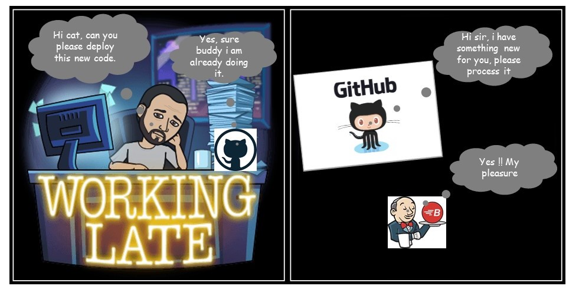

# Jenkins File

## Continuous Integration flow

The current Platform-DXC **Continuous Integration** flow is currently composed of :

- Your favorite **Integrated Development Environment (ide)** (Visual Code, Visual Studio, Eclipse ....)
- Your loved GitHub DXC **Source Control Management (scm)**
- And ... your helpful **Orchestrator**, i named Jenkins

## How does it work ?
Even if Jenkins is powerfull, it is not a wizard, there is no magic in his work.

The Jenkins administrator worked to easy your job, indeed they configured jenkins to search inside the DXC organizations for the Holy Grail which is a set of Jenkinsfile describing your pipeline. The only think you have to do is to put one Jenkinsfile in your repository to automatically create all the jobs composing your pipeline.

## You are the most powerfull user

Despite the Jenkins installation is voluntary kept minimal, the environment offers **Docker** to teams. Thanks to docker you have all the tools you can image availables for your pipeline. I saids the power is yours.

## How to proceed

You have to create a file named Jenkinsfile inside your repository, the prefered location is at the top.

Then describe your pipelines :

    Jenkinsfile (Declarative Pipeline)
    pipeline {
        agent none 
        stages {
            stage('Example Build') {
                agent { docker 'maven:3-alpine' } 
                steps {
                    echo 'Hello, Maven'
                    sh 'mvn --version'
                }
            }
            stage('Example Test') {
                agent { docker 'openjdk:8-jre' } 
                steps {
                    echo 'Hello, JDK'
                    sh 'java -version'
                }
            }
        }
    }

You will find the complete Jenkinsfile documentation [here](https://jenkins.io/doc/book/pipeline/syntax/)

Jenkins embed a help to create the jenkinsfile a the following url http://18.220.205.59:8080/job/<org_name>/pipeline-syntax/

