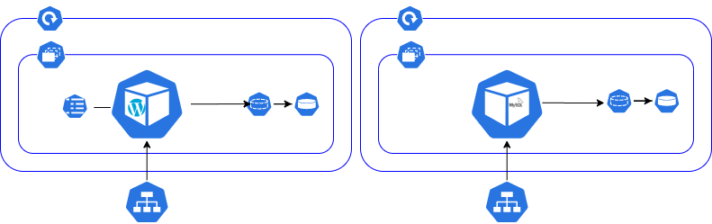
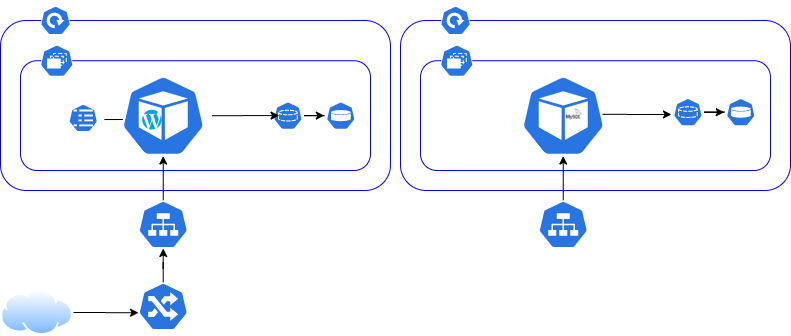

[**[watch the replay]**](https://dxc.workplace.com/100022623742139/videos/666197697477682){target="_blank"}

# Kubernetes-wordpress
*This handson training is a follow up of the Kubernetes Introduction talk downloadable [here](https://dxc.workplace.com/download/2556767854651343/Kubernetes-introduction-2019-02-04.pptx?av=100022938067041&eav=AfbzblXl7Czbg1tdSRf0JRV02_7sIWkNLHeW34KZ_TUFGq7cgl-LJPOk0e-M45UleWI&hash=AcqPaYDL3dSkJSPa).*

During this session you will discover the Kubernetes basic components which are used to deploy a high available WordPress stack. If you like consoles and Kubernetes, join us and enjoy the Kubernetes learning trip.

I made the choice to not use all the kubectl functions to priviledge the usage of manifest files. This is because it makes an Infrastructure As Code approach easier.

# Pre-requisite

- A Kubernetes cluster
- Work directory is /tutorials/kubernetes-wordpress

# Namespace

*A namespace is a Kubernetes environment used to isolate ressources.*

## Create a namespace

```shell
kubectl apply -f manifests/namespace.yaml
```
## Verify the namespace was created

```shell
kubectl get namespace demo
```

# Pods

*Basic execution unit of a Kubernetes application, all containers inside a pods share the same storage and network.*

## Create a pod


```shell
kubectl apply -f manifests/pod.yaml
```
>**Observations:**
>
> - If you have a look the manifest file you will notice that the mysql host address is the pod name, indeed containers inside a pod shares the same IP.
> - Multiple containers are defined, this is because a pod is composed of one or multiple containers.

## Check the pod is running

```shell
kubectl get pods --namespace demo
```

>**Observations:**
>
> The kubectl cli return :
> 
> - The age of the pod
> - The number of restart, it may help to detect an unstability


## Check the pod logs

```shell
kubectl logs -c wordpress wordpress-pod --namespace demo
kubectl logs -c mysql wordpress-pod --namespace demo
```

## Access wordpress

```shell
kubectl port-forward --namespace demo pods/wordpress-pod 8080:80
```

>**Observations:**
>
> kubectl port-forward is a convenient way to access kubernetes endpoints which are not publicly  exposed.


## Robustness

Stop the wordpress container and check the pod status

```shell
kubectl exec -ti --namespace demo -c wordpress wordpress-pod kill 1 && kubectl get pods --namespace demo
```

Check again the pod satus

```shell
kubectl get pods --namespace demo
```

>**Observations:**
>
> After a short period of time the container is restarted. Indeed a pod ensure his contained containers are still up and running. This is the first level of self healing we can find in Kubenetes.

# Config map

*A config map is used to store configurations and apply it to a pod / container. You can create a config map from a directory, a file or again a litteral value.*


## Create a configuration map

```shell
kubectl apply -f manifests/configmap.yaml
```

>**Observations:**
>
> The data section of a config map contains keypair values used to store configuration items. 

## Verify it has been created

```shell
kubectl get configmap --namespace demo
```
>**Observations:**
>
> The CLI returns :
>
> - The number of keys contained into the config map
> - The age of the config map


## Config map usage

In this example we will populate the environment variables from the config map and create a test file on the pod disk. 

### Create the pod

```shell
kubectl delete -f  manifests/pod.yaml
kubectl apply -f manifests/pod-vol.yaml
```

### Describe the pod

```shell
kubectl describe pods -n demo wordpress-pod
```

>**Observations:**
>
> The CLI returns :
>
> - All the pod Kubernetes events
> - All the pods meta data such as port used, docker image ...
> - In the WordPress.Environment section, you will the that the variables have been populated by the config map.

### Verify our custom configuration file was pushed

```shell
kubectl exec -ti -c wordpress wordpress-pod -n demo ls /var/www/html/k8s-wp-config.php
```
Our custom configuration file is returned, thus it was correctly created.

### Ephemeral storage

To access WordPress and finaliazd the configuration :

1. Open a tunnel
```shell
kubectl port-forward --namespace demo pods/wordpress-pod 8080:80
```

2. Navigate to http://localhost:8080 and complete the WordPress configuration

3. Delete and recreate the pod
   
```shell
kubectl delete -f manifests/pod-vol.yaml
kubectl apply -f manifests/pod-vol.yaml
kubectl port-forward --namespace demo pods/wordpress-pod 8080:80
```
4. Open a tunnel and reach WordPress
   
```shell
kubectl port-forward --namespace demo pods/wordpress-pod 8080:80
```

>**Observations:**
>
> Your configuration disappears. This is because your MySQL data are stored on an ephemeral storage with a life time equal to the pod life time.

# Persistent Volume Claim


## Create a PVC

*A persistent volume claim is a Kubernetes user side object used to request a persistent storage managed by Kubernetes administrators.*

Request a persistent volume to store the MySQL data.

```shell
kubectl delete -f manifests/pod-vol.yaml
kubectl apply -f manifests/mysql-pvc.yaml
```

## Check the PVC exist

```shell
kubectl get pvc --namespace demo
```

>**Observations:**
>
> The CLI returns:
>
> - The storage class used. The storage class is used to defined the type of storage used.
> - The status of the binding.
> - The size of the volume


## Bind the PVC to the wordpress pod

Create the WordPress pod and describe it

```shell
kubectl apply -f manifests/pod-vol-pvc.yaml
kubectl describe $(kubectl get pods -n demo --output=name) -n demo
```

>**Observations:**
>
> - In the Volumes section we can see the mysql-data pvc.
> - In mysql.Mounts we can see the /var/lib/mysql mounted the PVC.

## Configure WordPress

1. Open a tunnel
   
```shell
kubectl port-forward --namespace demo pods/wordpress-pod 8080:80
```

1. Navigate to http://localhost:8080 to complete the configuration

2. Delete and recreate the pod
   
```shell
kubectl delete -f manifests/pod-vol-pvc.yaml
kubectl apply -f manifests/pod-vol-pvc.yaml
```

3. Open the tunnel and open the WordPress website

```shell
kubectl port-forward --namespace demo pods/wordpress-pod 8080:80
```

> **Observations:**
> 
> This time you directly reach the WordPress public interfce. It means your configuration survice to the restart. This is because the MySQL data are stored on a persistant volume.

## Let's delete the pod

```shell
kubectl delete pods --namespace demo wordpress-pod
kubectl get pods --namespace demo
```

> **Observations:**
>
> - The pod disappeared and was not recreated, this because the Pod is responsible to ensure the contained containers are still present, but it can't ensure itself is up and running.

# ReplicaSet

*Replicasets are used to maintain a number of avaible pods.*


## Create a replicaset

```shell
kubectl apply -f manifests/replicaset.yaml
```

## Check the replicaset exists

```shell
kubectl get replicaset --namespace demo
```

As for all the other objects you can get more details in running a describe command.

```shell
kubectl describe replicaset --namespace demo wordpress-replicaset
```

## Check pods were created

```shell
kubectl get pods --namespace demo
```

## Create a non managed pod

Let's create a pod not managed by the replicaset, and list the pods inside the namespace.

```shell
kubectl apply -f manifests/pod.yaml && kubectl get pods --namespace demo
```

> **Obersvations:**
>
> The pod is automatically terminated. This is because the replicaset manages all the pods which have the label *app: wordpress*. As the maximum number of pods was already created, all the new ones are automatically terminated.

## Try to kill all pods

```shell
kubectl delete pods --all --namespace demo
```

## Check pods status

```shell
kubectl get pods --namespace demo
```

> **Observations:**
>
> - New pods have been created, this is because a replicaset ensure a specific number of replicas is available.
> - Pods are named per the replicaset name.

## Horizontally scale

1. Edit the file replicaset.yaml
2. Modify the number of replicas
3. Save the file
4. Apply the new configuration

    ```shell
    kubectl apply -f manifests/replicaset.yaml 
    ```
5. Get the pods
    ```shell
    kubectl get pods --namespace demo
    ```
> **Observations:**
> 
> - New pods are created. 
> - We can create a pod auto scaller to trigger horizontal scale based on pod metrics.

# Deployment

*While Replica Sets still have the capability to manage pods, and scale instances of certain pod, they don’t have the ability to perform a rolling update and some other features. Instead, this functionality is managed by a Deployment, which is the resource that a user using Kubernetes today would mostly likely interact with.*


## Create a deployment

As only one MySQL instance can access the MySQL data directory at a time, let's split our pod in two deployments with a dedicated volume for the wordpress containers.

```shell
kubectl apply -f manifests/wordpress-pvc.yaml
kubectl apply -f manifests/wordpress-deployment.yaml -f manifests/mysql-deployment.yaml
```

## Get pods

```shell
kubectl get pods -n demo
```

The wordpress and mysql pods were created

## Get deployments

```shell
kubectl get deployments --namespace demo
```
## Get replicasets

```shell
kubectl get replicaset -n demo
```

> **Observations:**
>
> - Pods are named using the deployment name
> - Pods created by the replica set does not count in the deployment pods, this is because deployments create their own replicaset.

## Describe deployments

```shell
kubectl describe deployment wordpress-deployment --namespace demo
```

>**Observations:**
>
> The default update strategy is *RollingUpdate (25% max unavailable, 25% max surge)*

## Update your wordpress version

1. Edit the file manifests/deployment.yaml
2. Line 32 modify the tag *5.3-php7.2* with *latest*
3. Save and apply your changes
    ```shell
    kubectl apply -f manifests/wordpress-deployment.yaml
    ```
4. Observe your update
    ```shell
    kubectl get pods --namespace demo
    ```

> **Observations:**
>
> During the update some pods are still up to serve the traffic. The deployment behaviour can be customized.

## Rollback

1. Display the deployment versions
    ```shell
    kubectl rollout history deployment.v1.apps/wordpress-deployment --namespace demo
    ```
2. You can display the second revision content with:
    ```shell
    kubectl rollout history deployment.v1.apps/wordpress-deployment --namespace demo --revision 2
    ```
3. Rollback to the revision 1
   -  Either you undo the latest deployment
        ```shell
        kubectl rollout undo deployment.v1.apps/wordpress-deployment --namespace demo
        ```
   - Or you rollback to a specific version
        ```shell
        kubectl rollout undo deployment.v1.apps/wordpress-deployment --to-revision=1 --namespace demo
        ```

**We have a robust deployment, we can lost one pods it will be recreated, we can lost one container it will be recreated. That is super great but we can't load balance the traffic accross the replicas, we can just access it one by one.**

# Service

*A kubernetes service is an endpoint used to spread the incoming traffic accross multiple pods providing the same service.*



## Create a service

Create the services used to access the WordPress and the MySQL pods.

```shell
kubectl apply -f manifests/wordpress-service.yaml -f manifests/mysql-service.yaml
```

## Describe the service

```shell
kubectl describe services wordpress-svc --namespace demo
```

>**Observations:**
>
> - You can see the internal IP address of our service as well as the 4 endpoints IPs matching the pods IPs which are behind.
> - The service is of type ClusterIP, but there are differents kind of service which behave differently (NodeIP, LoadBalancer).

## Update the wordpress configuration

As the pod *wordpress-pod* no longer exists, the current configuration will not work. We have to update it with the kubernetes endpoint name to ensure we will be able to reach the mysql database.

```shell
kubectl delete -f manifests/configmap.yaml
kubectl apply -f manifests/configmap-svc.yaml

kubectl delete -f manifests/wordpress-deployment.yaml
kubectl apply -f manifests/wordpress-deployment.yaml
```

## Open a tunnel to our wordpress service

Open a tunnel

```shell
kubectl port-forward --namespace demo  svc/wordpress-svc 8080:80
```

>**Observations:**
>
> - We used the wordpress-svc service to reach one of the WordPress pods.
> - The WordPress pods are now accessible, but there are still not visible on internet.

# Ingress


*An ingress is a reverse proxy used to reach the internal applications from a client ouside the cluster.*

Let's create our unsecure wordpress ingress

```shell
kubectl apply -f manifests/ingress-tls.yaml
```

Verify the ingress was correctly created

```shell
kubectl get ingress -n demo
```

**additional configuration**

- kubectl port-forward --namespace demo  svc/wordpress-svc 8080:80


***Note:*** We have to configure WordPres with the DNS to make it works, indeed there is an internal rewrite mechanism which prevent to make it works if we don't have the good configuation'.