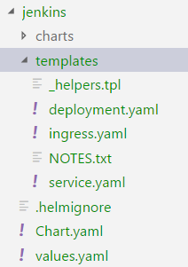

# Kubernetes and its friends <!-- omit in toc --> 

## Table of contents <!-- omit in toc --> 
- [Pre-requisite](#pre-requisite)
- [Install kubernetes](#install-kubernetes)
  - [Install with KOPS (Kubernete OperationS)](#install-with-kops-kubernete-operations)
- [Resize your cluster nodes](#resize-your-cluster-nodes)
- [Deploy a container with kubernetes](#deploy-a-container-with-kubernetes)
  - [Create a manifest file](#create-a-manifest-file)
  - [Deploy the manifest](#deploy-the-manifest)
- [Deploy a container with Helm](#deploy-a-container-with-helm)
  - [Helm lint](#helm-lint)
  - [Deploy your chart](#deploy-your-chart)
- [Deploy a container with Spinnaker](#deploy-a-container-with-spinnaker)
  - [Install Spinnaker](#install-spinnaker)
  - [Create a Spinnaker pipeline template](#create-a-spinnaker-pipeline-template)
    - [Template sample](#template-sample)
    - [Template configuration](#template-configuration)
    - [Deploy your pipeline to Spinnaker](#deploy-your-pipeline-to-spinnaker)
- [Deploy a container with Jenkins-X](#deploy-a-container-with-jenkins-x)
- [References](#references)

## Pre-requisite

 - To manage the kubernetes stack you will need to install [kubectl](https://kubernetes.io/docs/tasks/tools/install-kubectl/) CLI.


## Install kubernetes

As per the [kubernetes web site](https://kubernetes.io/docs/setup/pick-right-solution/) there are plenty of ways to install a kubernetes cluster. However the one i choosen is not listed in this website but was produced by kubernetes.

### Install with [KOPS (Kubernete OperationS)](https://kubernetes.io/docs/setup/custom-cloud/kops/)
```Shell
# Configure AWS Region to use, the aws key and secret are in your ~/.kube folder
REGION=us-west-1

# Configure the cluster name and availability zones
AVAILABILITY_ZONES=us-west-1a,us-west-1c
CLUSTER_NAME=kube.platformdxc-test.com

# Configure the bucket s3 used to store the cluster information
BUCKET_NAME=lgil3-kubernetes
export KOPS_STATE_STORE=s3://$BUCKET_NAME

# Create the S3 bucket if it does not exist
if ! aws s3api list-buckets | grep $BUCKET_NAME; then
    aws s3api create-bucket --bucket $BUCKET_NAME  --region $REGION
    aws s3api wait bucket-exists --bucket $BUCKET_NAME
    aws s3api put-bucket-versioning --bucket $BUCKET_NAME --versioning-configuration Status=Enabled
fi

# Create your kubernetes cluster
kops create cluster $CLUSTER_NAME \
    --zones $AVAILABILITY_ZONES \
    --cloud aws  \
    --node-count 5 \
    --node-size c5.4.xlarge \
    --master-count 3 \
    --master-size t2.large \
    --master-zones $AVAILABILITY_ZONES \
    --alsologtostderr \
    --yes
 ```
 
**Congratulation you just deploy you first kubernetes cluster !!!!**


 
## Resize your cluster nodes
 
 You can list your [instance group](https://github.com/kubernetes/kops/blob/master/docs/instance_groups.md) in using:
 
    kops get ig
   
 The command output will be
 
```shell
  NAME                    ROLE    MACHINETYPE     MIN     MAX     ZONES
master-us-west-1a-1     Master  t2.large        1       1       us-west-1a
master-us-west-1a-2     Master  t2.large        1       1       us-west-1a
master-us-west-1c-1     Master  t2.large        1       1       us-west-1c
nodes                   Node    t2.2xlarge      3       9       us-west-1a,us-west-1c
 ```
 
Then you can edit your instance groups in using

    kops edit ig <ig name> --state s3://lgil3-kubernetes
   
 For the instance group nodes, the file content is
 
 ```yaml
    apiVersion: kops/v1alpha2
    kind: InstanceGroup
    metadata:
      creationTimestamp: 2018-06-07T13:45:18Z
      labels:
        kops.k8s.io/cluster: kube.platformdxc-test.com
      name: nodes
    spec:
      image: kope.io/k8s-1.9-debian-jessie-amd64-hvm-ebs-2018-03-11
      machineType: t2.2xlarge
      maxSize: 9
      minSize: 3
      nodeLabels:
        kops.k8s.io/instancegroup: nodes
      role: Node
      subnets:
      - us-west-1a
      - us-west-1c             
```

change the minSize to 4 and apply the change :

    kops update cluster kube.platformdxc-test.com --yes --state s3://lgil3-kubernetes
    kops rolling-update cluster  kube.platformdxc-test.com --state=s3://lgil3-kubernetes --yes


**Amazing you just scale your cluster**


## Deploy a container with kubernetes

### Create a manifest file

Create a manifest file with the following content :
```yaml
kind: Namespace
apiVersion: v1
metadata: 
    name: jenkins-test
    labels: 
        name: jenkins-test
---
apiVersion: apps/v1beta2
kind: Deployment
metadata:
  name: jenkins
  labels:
    app: jenkins
  namespace: jenkins-test
spec:
  replicas: 1
  selector:
    matchLabels:
      app: jenkins
  template:
    metadata:
      labels:
        app: jenkins
    spec:
      containers:
        - name: jenkins
          image: "jenkins/jenkins"
          imagePullPolicy: Always
          ports:
            - name: http
              containerPort: 8080
              protocol: TCP
            - name: jnlp
              containerPort: 50000
              protocol: TCP
          volumeMounts:
          - mountPath: /var/jenkins_home
            name: jenkins-home
      volumes:
      - name: jenkins-home
        emptyDir: {}
  ```

### Deploy the manifest

Download the *[manifest](manifest.yaml)* file  and execute the following command. The manifest will create the `jenkins-test` namespace and will deploy a jenkins pod.


    kubectl create -f manifest.yaml

You can check that your jenkins pod was created in  using :

    kubectl get pods -n jenkins-test

if you need more details about your pod you can execute :

    kubectl describe pods <pod name>-n jenkins-test

## Deploy a container with Helm

You can create a jenkins helm chart with :

    helm create jenkins

The comment will create a new repository with the following structure :



- The template folder contains a basic chart definition. 
- The values file will contain the chart parameters

Edit the `values.yaml` file : 

- change the parameter `repository` to *jenkins/jenkins*
- change the parameter `tag` to *2.130*

Edit the file `templates/deployment.yaml` :

- Change the line 28 `containerPort` to 8080
- Remove the following lines :

```yaml
livenessProbe:
    httpGet:
        path: /
        port: http
readinessProbe:
    httpGet:
        path: /
        port: http
```
We need to do it as the default container is nginx and we are trying to deploy jenkins

### Helm lint

Helm comes with a linter to check your chart syntax, go into the jenkins helm folder and execute :

    helm lint .

### Deploy your chart
From your chart folder

    helm install --name jenkins --namespace jenkins-test --values values.yaml . 

Access your jenkins server in using the following commands :

    export POD_NAME=$(kubectl get pods --namespace jenkins-test -l "app=jenkins,release=jenkins" -o jsonpath="{.items[0].metadata.name}")
    kubectl port-forward $POD_NAME 8080:8080 -n jenkins-test

Navigate to http://127.0.0.1:8080


## Deploy a container with Spinnaker

### Install Spinnaker

You can deploy Spinnaker in using [Halyard](https://www.spinnaker.io/setup/install/halyard/). [Halyard](https://www.spinnaker.io/setup/install/halyard/) is a CLI used to generate a configuration file which will be applied against your cloud provider. In my use case i used the kubernetes cluster previously created. However you can target another cloud provider such as EC2,GCE ....

### Create a Spinnaker pipeline template

> You can configure Spinnaker from the UI or from code. 

A Spinnaker pipeline is composed of a template and a configuration which is very powerfull as you can reuse a template pipeline over different project.


As the template pipeline is shared accross several projects if you modify it once it will update all the associated pipelines.

#### Template sample
elk-template.yml

```yaml
schema: "1"
id: demo-template

metadata:
  name: demo app template
  description: Kubernetes v2 deploy with a Github trigger template for a demo app
  scopes:
    - global

variables:
- name: gitBranch
  type: string
  description: Git branch to trigger on
- name: k8App
  type: string
  description: Application this resource belongs to. Affects where the resource is accessible in the UI
- name: k8Cluster
  type: string
  description: Cluster this resource belongs to. Logical grouping for the UI.
- name: repository
  type: string
  description: The repository name

configuration:
  concurrentExecutions:
    limitConcurrent: true
    parallel: false
  expectedArtifacts:
  - id: k8ArtifactId
    defaultArtifact:
      type: custom
    matchArtifact:
      kind: github
      type: github/file
      name: deploy/manifest.yaml
    useDefaultArtifact: false
    usePriorArtifact: false
    usePriorExecution: false
  triggers:
  - type: git
    branch: "{{ gitBranch }}"
    source: github
    project: lgil3
    slug: "{{ repository }}"
    enabled: true
    expectedArtifactIds:
      - k8ArtifactId
 
stages:
- id: deployK8Manifest
  type: deployManifest
  name: Deploy K8s manifest
  config:
    cloudProvider: kubernetes
    account: sandbox-manifest
    source: artifact
    manifestArtifactId: k8ArtifactId
    manifestArtifactAccount: lgil3
    relationships:
      loadBalancers: []
      securityGroups: []
    clusters: []
    moniker:
      app: "{{ k8App }}"
      cluster: "{{ k8Cluster }}"
```

#### Template configuration

elk-config.yaml

```yaml
schema: "1"
pipeline:
  application: elasticsearch
  name: Deploy ELK suite
  template:
    source: https://github.dxc.com/raw/lgil3/kube-spinnaker-template/master/elk-template.yml?token=AAASjpLFBNTtMwyqjMS4RZYONXDmwD6uks5bPzPfwA%3D%3D
  variables: 
    repository: chart-elk
    gitBranch: master
    k8App: elasticsearch
    k8Cluster: elasticsearch-cluster
configuration:
  inherit: ['expectedArtifacts','concurrentExecutions', 'triggers', 'parameters']
```

We can see in the pipeline/template/source the reference to the source template in github.

This pipeline is configure to follow the master branch of the repository chart-elk, it will be triggered each time the file deploy/manifest.yml is modified.

#### Deploy your pipeline to Spinnaker
You can now push your pipeline to Spinnaker in using the [roer](https://github.com/spinnaker/roer) cli.

1. Create the spinnaker application
```bash
roer --as $(token) app create elasticsearch createApp.yml
```

2. Create your deployment pipeline
  ```bash
  roer --as $(token)	pipeline save elk-config.yaml
  ```


## Deploy a container with Jenkins-X


## References
- [https://kubernetes.io/docs/reference/kubectl/cheatsheet/](https://kubernetes.io/docs/reference/kubectl/cheatsheet/)
- [https://github.com/spinnaker/dcd-spec/blob/master/PIPELINE_TEMPLATES.md](https://github.com/spinnaker/dcd-spec/blob/master/PIPELINE_TEMPLATES.md)
- [https://github.com/spinnaker/roer](https://github.com/spinnaker/roer)

    