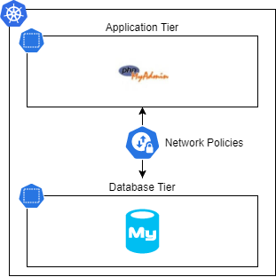

# Kubernetes Cluster Hardening

## Network security

Kubernetes clusters are often considered as black boxes, which conduct network security teams to focus on securing the network outside the cluster. However, probably because of a lack of knowledge, the internal cluster network is not secured at all. Kubernetes offers an out of the box feature named **Network Policies** which allows users to create a multi tier architecture inside the clusters.

Let's create a basic **two tiers architectures** inside a cluster. It will be composed of a MySQL database and a phpMyAdmin application.

The demo code will be hosted on [github](https://github.com/angegar/k8s-security){target=_blank}

<center>



*Demo Application Architecture*
</center>

### Pre-requisite

Network policies are implemented by a [network plugin](https://kubernetes.io/docs/concepts/extend-kubernetes/compute-storage-net/network-plugins/){target=_blank}. To use network policies, you must be using a networking solution which supports NetworkPolicy. Creating a NetworkPolicy resource without a controller that implements it will have no effect. 

*([extract from the kubernetes doc](https://kubernetes.io/docs/concepts/services-networking/network-policies/#prerequisites){target=_blank})*


As the demo runs on an AKS clusters, the choosen network policy is [calico](https://docs.projectcalico.org/about/about-calico){target=_blank}.


### Container Network Interface

CNI (Container Network Interface), a Cloud Native Computing Foundation project, consists of a specification and libraries for writing plugins to configure network interfaces in Linux containers, along with a number of supported plugins. CNI concerns itself only with network connectivity of containers and removing allocated resources when the container is deleted. Because of this focus, CNI has a wide range of support and the specification is simple to implement.

*([source](https://github.com/containernetworking/cni){target=_blank})*

### Deploy components

Execute the command below to create :

- the *app* and *data* namespaces
- the mysql pod and service
- the phpMyAdmin pod and service

```shell
kubectl apply -f namespaces.yaml
```

!!! warning
    The `*-policy.yaml-hold` files must be named `*-policy.yaml-hold` to avoid to be deployed

### Verify the deployment

- Open a tunnel to the phpmyadmin service

    ```shell
       kubectl port-forward -n app svc/phpmyadmin 8080:80
    ```

- Connect the [phpMyAdmin UI](http://localhost:8080)
- The phpMyAdmin web site should be accessible

### Apply default network policies

The purpose of this policy is to block any ingress or egress trafic using the data namespace.
It is wise to apply a such rule to all the namespaces and explicity allows only the minium required connections.

```yaml
apiVersion: networking.k8s.io/v1
kind: NetworkPolicy
metadata:
  name: default-deny-all
  namespace: data
spec:
  podSelector: {}
  policyTypes:
  - Ingress
  - Egress
```

Apply this NetworkPolicy will break the connection between phpMyAdmin and the backend MySQL datatabase.

### Authorize trafic

The NetworkPolicy below will enable the trafic on port 3306 from pods, in namespaces configured with the label `tier=app`, which have the label app=phpmyadmin.

```yaml
apiVersion: networking.k8s.io/v1
kind: NetworkPolicy
metadata:
  name: allow-from-phpmyadmin-ingress
  namespace: data
spec:
  podSelector: {}

  policyTypes:
  - Ingress

  ingress:
    - from:
      - namespaceSelector:
          matchLabels:
            tier: app
        podSelector:
          matchLabels:
            app: phpmyadmin
      # - ipBlock:
      #   cidr: 172.17.0.0/16
      #   except:
      #   - 172.17.1.0/24
      ports:
        - protocol: TCP
          port: 3306
```

!!! info
    Find more information about NetworkPolicy in the [official documentation](https://kubernetes.io/docs/concepts/services-networking/network-policies/){target=_blank}

## Security compliance

### Admission webhook

Admission webhooks are HTTP callbacks that receive admission requests and do something with them. You can define two types of admission webhooks, validating admission webhook and mutating admission webhook. Mutating admission webhooks are invoked first, and can modify objects sent to the API server to enforce custom defaults. After all object modifications are complete, and after the incoming object is validated by the API server, validating admission webhooks are invoked and can reject requests to enforce custom policies.

*([source](https://kubernetes.io/docs/reference/access-authn-authz/extensible-admission-controllers/#what-are-admission-webhooks))*


### Open Policy Agent (OPA) Gatekeeper

It is an [open source project](https://github.com/open-policy-agent/gatekeeper){target=_blank} used to enforece a set of compliance rules. As example, it may enforce the usage of a company docker registry and reject any other registries. It can also help to analyze the incoming request content and ensure that the container does not run as root.

OPA Gatekeeper comes with a [public library](https://github.com/open-policy-agent/gatekeeper-library){target=_blank} provided users with a pre-defined set of bets practices.


### Pre-requisite

OPA GateKeeper must be deployed on the demo cluster.

### Example

In this example, we will only allow phpMyAdmin and mysql to be deployed in the cluster.

#### Deploy the rule template

The rule template will a create a Custom Ressource Definition (CRD) which will be usable to enforce some practices.

The **ConstraintTemplate** below is a standard one used to enforce container  iamge source repository. The **Rego** language is used to speficy the template behaviour, this abstraction prevent the hardship of custom admission webhook creation and make simplier the creation of constraints policies.

```yaml
apiVersion: templates.gatekeeper.sh/v1beta1
kind: ConstraintTemplate
metadata:
  name: k8sallowedrepos
  annotations:
    description: Requires container images to begin with a repo string from a specified
      list.
spec:
  crd:
    spec:
      names:
        kind: K8sAllowedRepos
      validation:
        # Schema for the `parameters` field
        openAPIV3Schema:
          type: object
          properties:
            repos:
              type: array
              items:
                type: string
  targets:
    - target: admission.k8s.gatekeeper.sh
      rego: |
        package k8sallowedrepos

        violation[{"msg": msg}] {
          container := input.review.object.spec.containers[_]
          satisfied := [good | repo = input.parameters.repos[_] ; good = startswith(container.image, repo)]
          not any(satisfied)
          msg := sprintf("container <%v> has an invalid image repo <%v>, allowed repos are %v", [container.name, container.image, input.parameters.repos])
        }

        violation[{"msg": msg}] {
          container := input.review.object.spec.initContainers[_]
          satisfied := [good | repo = input.parameters.repos[_] ; good = startswith(container.image, repo)]
          not any(satisfied)
          msg := sprintf("container <%v> has an invalid image repo <%v>, allowed repos are %v", [container.name, container.image, input.parameters.repos])
        }
```

#### Enforce a constraint

Execute the code below

```yaml
apiVersion: constraints.gatekeeper.sh/v1beta1
kind: K8sAllowedRepos
metadata:
  name: allowed-phpmyadmin
spec:
  match:
    kinds:
      - apiGroups: [""]
        kinds: ["Pod"]
    namespaces:
      - "app"
  parameters:
    repos:
      - "phpmyadmin"
```

This constraint will forbid the deployment of containers other than the `phpmyadmin` one. Because OPA Gatekeeper templates are used to create new Custom Resource Definision, it becomes easy to add constraints.

#### Execute a deployment test

Execute the code below

```yaml
apiVersion: v1
kind: Pod
metadata:
  labels:
    run: pods
  name: pods
  namespace: app
spec:
  containers:
  - image: nginx
    name: nginx
    resources: {}
  dnsPolicy: ClusterFirst
  restartPolicy: Always

---

apiVersion: v1
kind: Pod
metadata:
  labels:
    run: pods
  name: pods
  namespace: app
spec:
  containers:
  - image: phpmyadmin
    name: phpmyadmin
    resources: {}
  dnsPolicy: ClusterFirst
  restartPolicy: Always
```

The console will show and error about the nginx deployment, indeed the nginx container is not authorized to be deployed in the **app namespace**


## Sum-up

This handons is just an overview of two technology which can be used to ensure security of a kubernetes cluster. I advise trainees to go deeper in a network plugin such as calico and to get familiar with the Rego language as it will allow them to create amazing custom rules.