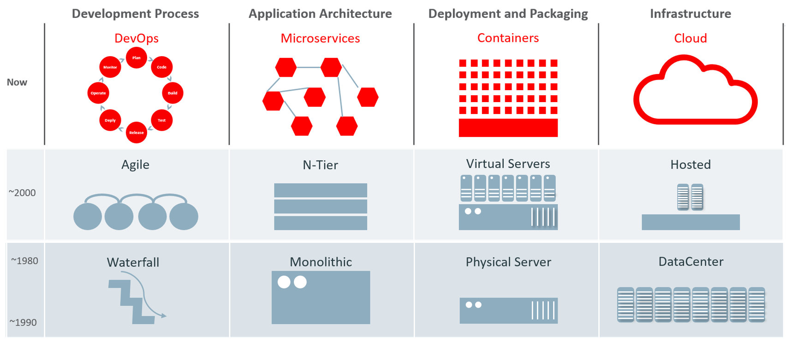
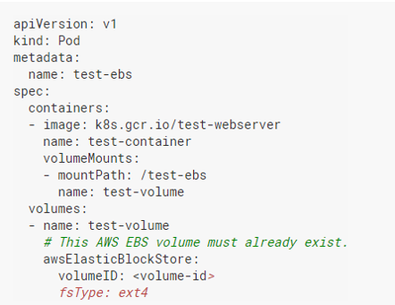
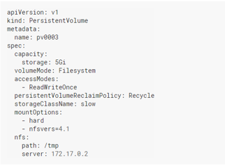
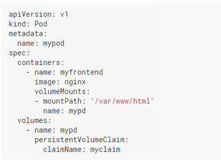
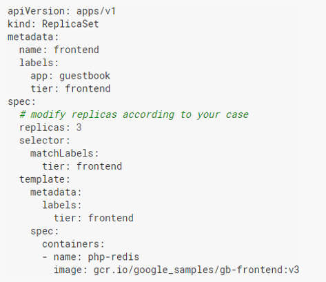
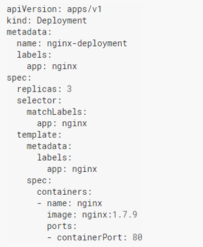

# Kubernetes Office Hours
## Kubernetes - Overview
[**[watch the replay]**](https://web.microsoftstream.com/video/02933a8e-e1ad-423c-8d9e-ca5c49d1e968)

---

# Get in touch with the community

|  	|https://dxc.workplace.com/groups/kubernetescommunity|
|------	|-------	|
|    	| [Technology Guilds@DXC > Kubernetes](https://teams.microsoft.com/l/channel/19%3a8cfa4cd6373643ceaff18fd56f3f4467%40thread.tacv2/Kubernetes?groupId=dd651bdf-b660-43e6-af20-59a1a318c015&tenantId=93f33571-550f-43cf-b09f-cd331338d086)    |

---

# What will we talk about

- Container as a deployment unit
- Kubernetes a container orchestrator
- Kubernetes basic concepts

---

# Back to the future

---

# From bare metal to containers

- Reproductible runtime environment
- Better manage resources
- Well fit microservice architectures

---

# Deployment issue

How to deploy multiple containers in a reliable and repeatable way

---

# Orchestrators

---

# Out of the box features

- Horizontal auto scalling
- Vertical auto scalling
- Storage management / orchestration
- Rolling update
- Extendable - Custom Resource definition
- Robustness (Pod Disruption Budget, self healing)
- Monitoring
- Cluster federation

---

# Benefits

- Focused on application, not on infrastructure
- Accelerate your deployments
- Decrease your downtime
- Cloud agnostic
- Decrease infrastructure cost (better manage and tune your ressources)
- Decrease overall maintenance cost
- Decrease observability and monitoring cost

---

# Architecture

[Full documentation](https://kubernetes.io/docs/concepts/overview/components/)

---

# Control Plane Components

- Control Plane: Make global decision about the cluster
- kube-apiserver: exposes the Kubernetes API
- etcd: key value store used as Kubernetes' backing store for all cluster
- kube-scheduler: Assign pods to node
- Kube-contoller-manager: Runs controller processes

---

# Node Components

- Kubelet: Makes sure that containers are running in a Pod
- Kube-proxy: Allow network communication to your Pods from network sessions inside or outside of your cluster.
- Container runtime:  Software responsible for running containers

---

# Addons

## Mandatory

- DNS: DNS server, in addition to the other DNS server(s) in your environment, which serves DNS records for Kubernetes services

## Optional

- Dashboard: Allows users to manage and troubleshoot applications running in the cluster, as well as the cluster itself
- Container Resource Monitoring: Records generic time-series metrics about containers in a central database, and provides a UI for browsing that data
- Cluster level logging: Logging mechanism responsible for saving container logs
  
---

# Hosting

## Cloud

- [GCP - Google Kubernetes Engine](https://cloud.google.com/kubernetes-engine)
- [AWS - Elastic Kubernetes Service](https://docs.aws.amazon.com/eks/index.html)
- [Azure - Azure Kubernetes Service](https://azure.microsoft.com/fr-fr/services/kubernetes-service/)

## Local

- [Docker windows with kubernetes](https://www.docker.com/blog/docker-windows-desktop-now-kubernetes/)
- [MiniKube](https://kubernetes.io/docs/setup/learning-environment/minikube/)
- [k3s](https://k3s.io/)

---

# Deployment

- [Kops](https://kubernetes.io/docs/setup/production-environment/tools/kops/)
- [Kubespray](https://kubernetes.io/docs/setup/production-environment/tools/kubespray/)
- [Kubeadm](https://kubernetes.io/docs/setup/production-environment/tools/kubeadm/create-cluster-kubeadm/)

---

# Kubernetes concepts

---

# Pods

- Basic execution unit
- Composed of one or multiple containers
- Containers inside a pod share IPs and storage resources

---

# Config Map

- Decouple configuration from image content
- Configuration stored as key pair values
- Create config map from:
  - Directory
  - File
  - Literal values
- Used to :
  - Load environment data content
  - Push configuration files inside containers

---

# Volumes

- On-disk files are ephemeral
- Storage shared between pod containers
- Data preserved across container restarts
- Deleted when the pod cease to exist
- Multiple type of volume can be used simultaneously

---

# Persistent volumes

- Piece of storage
- Privisionned by the administrator or dynamically provisionned
- Lifecycle independent of the pod

---

# Persistent volumes claims

- Request for storage
- Consume persistent volumes
- Use Storage class which are storage flavours defined by the cluster administrator

---

# Replicaset

- Guarantee the availability of a specified number of identical Pods at any given time
- Identify Pods to acquire by using its selector
- Once acquire, the pod metadata.ownerReferences  is set with the replicaset identifier

**Replicaset are now manages by Deployments**

---

# Deployments

- Deploy:
  - Describe a desired state
  - Provides declarative updates for Pods and ReplicaSets
- Update:
  - Scale
  - Rolling Update
  - Canary deployment
- Rollback changes

---

# Service

- Act as a load balancer to expose multiple pod serving the same application
- Route traffic based on pod labels
- Provide a fix endpoint
- Expose kubernetes and non Kubernetes endpoints

---

# Ingress

- Reverse proxy to your kubernetes infrastructure
- Handle SSL termination if configured
- Manage only HTTP and HTTPS traffic on standard ports